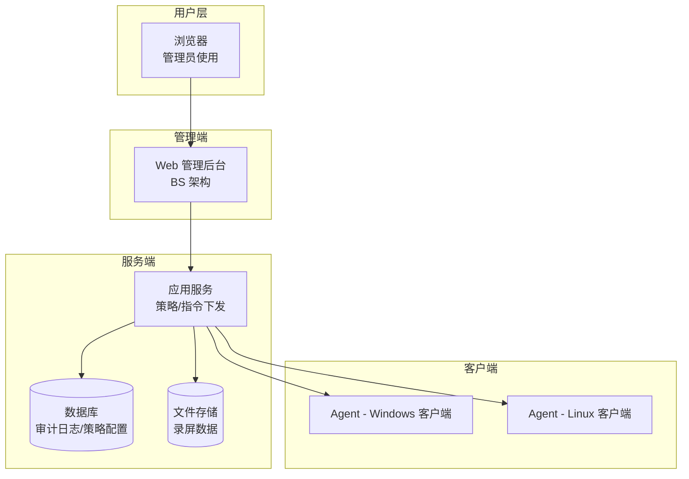
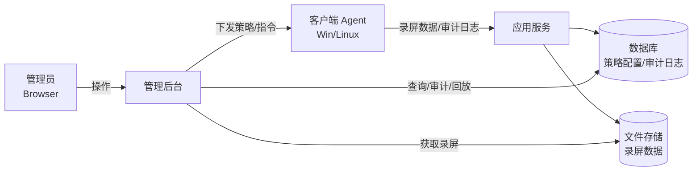

## 1. 物理部署架构图

**要点：**

* 管理端：BS 架构（浏览器 + Web 管理后台）
* 服务端：应用服务、数据库、文件存储（录屏数据、审计日志等）
* 客户端：各部门 PC/服务器，安装 agent（支持 Windows/Linux）
* 网络环境：内网部署，数据和指令均在内网中传输

---

## 2. 软件业务逻辑图

**核心逻辑：**

1. 管理员通过浏览器访问管理后台
2. 后台下发策略/指令到客户端 agent
3. Agent 执行操作（录屏、USB 封禁等），并上报数据
4. 服务端接收数据，存储到数据库/文件存储
5. 管理端提供审计、回放、报表功能

---

✅ 总结：

* **物理部署架构图** 体现了 **浏览器、Web 管理端、服务端（应用/数据库/存储）、客户端 Agent** 的物理分布关系。
* **软件业务逻辑图** 展示了 **管理员操作 → 策略下发 → Agent执行 → 数据回传 → 审计/回放** 的逻辑闭环。
