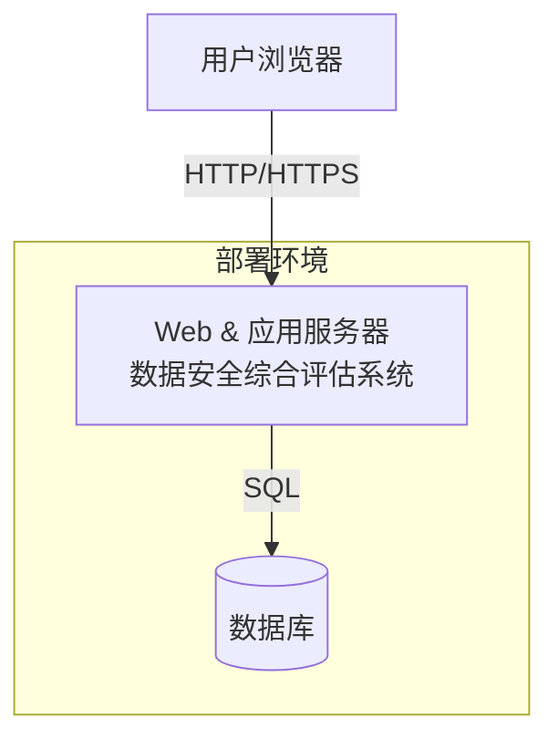
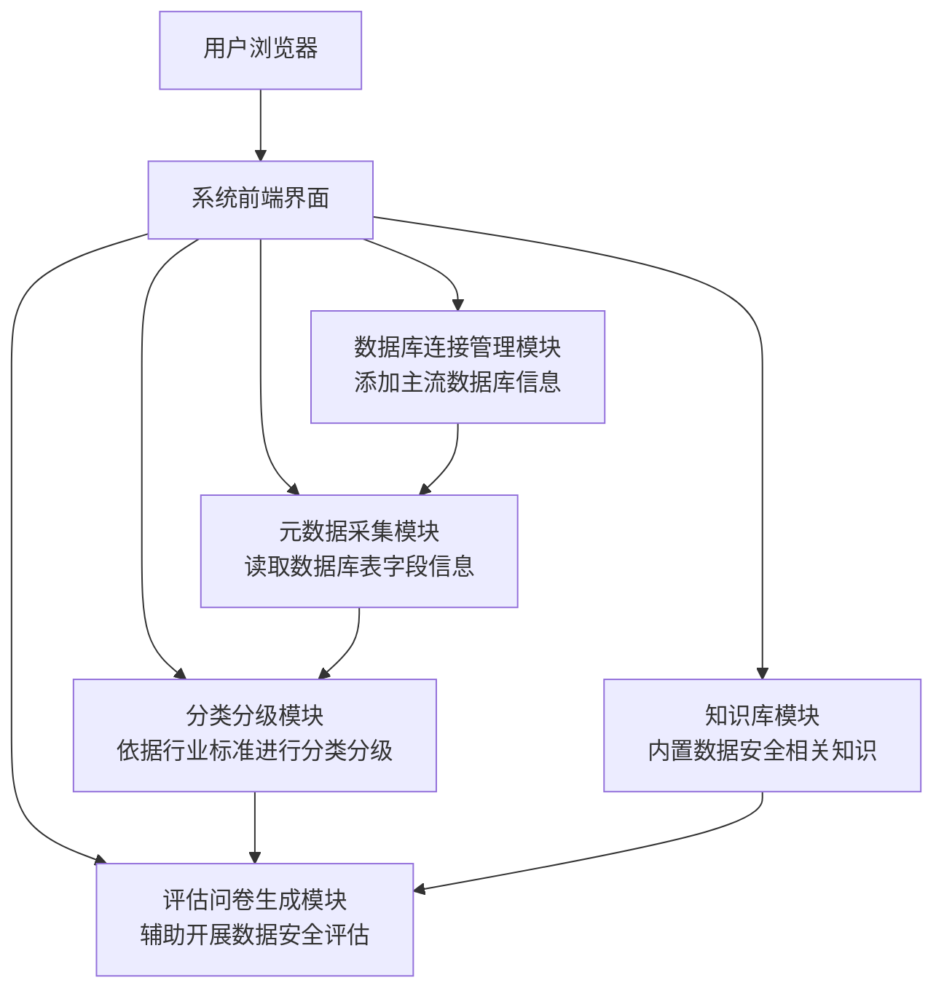

1. **物理部署架构图** → 强调系统的硬件/网络/服务器部署情况。
2. **软件业务逻辑图** → 强调系统的功能模块和交互关系。

我用 **Mermaid** 绘制，方便你直接放到文档里展示或导出成图。

---

## 物理部署架构图

说明：

* 典型的 **BS架构**。
* Web前端、应用逻辑和数据库统一部署在同一台服务器。
* 用户通过浏览器访问系统，系统通过数据库存储与查询评估数据。

---

## 软件业务逻辑图

说明：

* **核心流程**：连接数据库 → 采集元数据 → 分类分级 → 生成评估问卷。
* **辅助支持**：知识库模块为评估提供参考。
* **前端界面** 作为统一交互入口。

---

